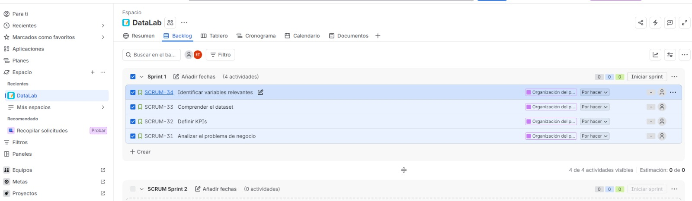
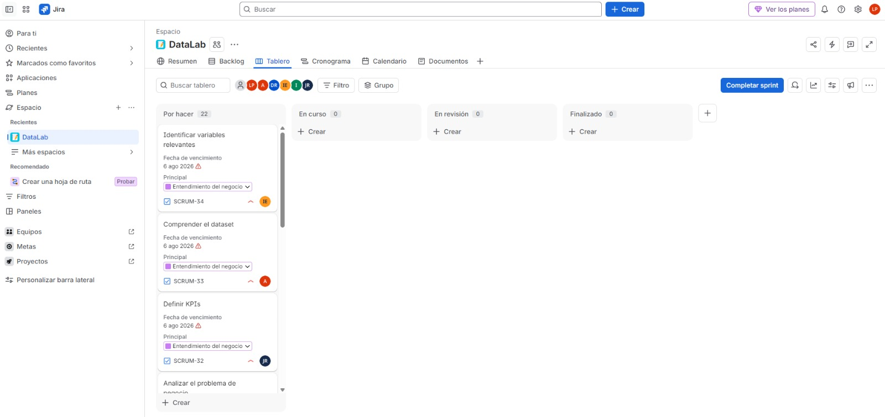

# Documentación del proceso de análisis y modelado

Este documento registra la evolución del proyecto durante el Sprint 1, procurando dejar constancia no solamente de lo que se implementó, sino también de los obstáculos encontrados, las decisiones que se tomaron para resolverlos y los puntos que todavía conviene revisar antes de considerar el sistema listo para despliegue.

La documentación sigue el mismo orden general en el que fue avanzando el trabajo: organización del proyecto, comprensión y preparación de datos, construcción de modelos, revisión técnica, correcciones de evaluación, consolidación de modelos y primeras pruebas de disponibilización.

## 1. Organización del Sprint y seguimiento del trabajo

Como punto de partida se creó el Sprint 1 dentro de Jira y se registraron las primeras actividades relacionadas con el entendimiento del negocio: análisis del problema, definición de KPIs, comprensión del dataset e identificación de variables relevantes.



Para organizar el Sprint 1 se definieron 6 épicas que representan las etapas generales del proyecto:

- Entendimiento del negocio
- Organización del proyecto
- Análisis Exploratorio (EDA)
- Feature Engineering
- Modelado
- Documentación Demo 1

Estas épicas permitieron agrupar las tareas específicas dentro de una secuencia coherente de trabajo.


Dentro de cada épica se generaron actividades específicas en Jira, con responsable, prioridad, fecha de vencimiento y estado. El tablero se utilizó para separar las tareas entre `Por hacer`, `En curso`, `En revisión` y `Finalizado`, mientras que el cronograma permitió observar cómo se distribuían las actividades durante el Sprint.

A medida que avanzó la planificación, las actividades generales se descompusieron en tareas más específicas dentro del Backlog. De esta forma fue posible asignar responsables, establecer fechas de entrega y mantener trazabilidad sobre las distintas etapas del análisis y modelado.



Esta organización ayudó a evitar que el trabajo de EDA, limpieza, feature engineering y modelado avanzara como tareas aisladas, ya que varias decisiones tomadas en una etapa terminaron afectando directamente a las siguientes.

Finalmente, el tablero Scrum permitió dar seguimiento al estado de cada actividad mediante las categorías **Por hacer**, **En curso**, **En revisión** y **Finalizado**. Esto facilitó visualizar el avance del equipo y detectar las tareas pendientes durante el Sprint.


## 2. Comprensión y preparación del dataset

El proyecto trabaja con el dataset `Online Retail II`, que contiene historial transaccional de una empresa de retail principalmente orientada a ventas de regalos y con una presencia importante de clientes mayoristas.

Durante el EDA se revisaron problemas de calidad como valores nulos, duplicados, cantidades negativas, cancelaciones y registros inválidos. La limpieza generó como resultado un archivo de trabajo llamado `DataSetLimpio.csv`, que posteriormente fue utilizado para los modelos.

### Obstáculo: diferencias entre la limpieza preliminar y la limpieza definitiva

Mientras se desarrollaban los primeros modelos se utilizó una limpieza preliminar para no detener el avance. Posteriormente se generó la limpieza oficial desde el EDA y aparecieron diferencias entre ambas versiones.

La versión proveniente del EDA había separado `InvoiceDate` en variables adicionales como día, mes, año y hora, además de incorporar una columna de precio total. Estas variables eran útiles para análisis exploratorio, pero no eran necesarias para la matriz de interacción utilizada por los modelos.

Para evitar que cada modelo dependiera de una estructura distinta, se corrigió el dataset de modelado y se mantuvieron las columnas originales necesarias para el pipeline. La información derivada que sirviera para análisis podía permanecer en el EDA sin obligar a los modelos a consumirla.

Esta situación dejó como aprendizaje que el dataset utilizado para exploración y el dataset utilizado para modelado pueden compartir origen, pero no necesariamente necesitan conservar exactamente las mismas variables derivadas. Lo importante es definir y documentar una versión estable como entrada del pipeline.

## 3. Primera estrategia de modelado

A partir del dataset limpio se construyó una matriz de interacción cliente-producto. Para mantener el orden temporal, las transacciones se ordenaron desde las más antiguas hasta las más recientes y se definió una división 80/20 para `TRAIN` y `TEST`.

Los primeros enfoques implementados fueron:

- Popularity Baseline
- Item-Based Collaborative Filtering
- FP-Growth / análisis de co-ocurrencia para cross-selling

El baseline se utilizó como referencia mínima de comparación. La lógica fue sencilla: identificar los productos con mayor volumen dentro de `TRAIN` y recomendar el mismo Top 10 a los clientes evaluados.

El modelo Item-Based CF utilizó similitud coseno entre productos a partir de la matriz cliente-producto. Conceptualmente, toma el historial del cliente, identifica productos relacionados con los que ya compró y devuelve un ranking de candidatos.

Por otro lado, el enfoque de FP-Growth trabajó a nivel de factura. Para este caso se construyeron canastas binarias, donde cada producto indica presencia o ausencia dentro de una factura, permitiendo estudiar relaciones de co-ocurrencia y oportunidades de cross-selling.

En las primeras pruebas de FP-Growth se utilizó un soporte mínimo de 0.02 para reducir ruido y concentrarse en patrones con presencia suficiente dentro del historial. A partir de estas asociaciones se analizaron métricas como soporte, confianza y lift.

---

## 4. Revisión técnica del repositorio y preparación para despliegue

A partir de este punto se realizó una revisión más detallada de la estructura del repositorio, dependencias, imports, lógica de evaluación y posibles problemas que podrían afectar una futura API o el despliegue.

El repositorio se trabajará principalmente sobre la rama develop, de la cual subyacen las demás ramas.

Comenzaremos por:
- Revisar los Pull Request que se generen, verificando conflictos, estructura, imports y ejecución
- Proteger las ramas principales main y develop, evitando merges directos y realizando revisiones(checks)
- Preparación para el despliegue, generando un archivo requirements.txt adecuado, manteniendo una estructura reproducible y estable para CI/CD.

GitHub nos permite proteger ramas para exigir PRs, aprobaciones y status checks antes de hacer merge. También puede impedir force push y eliminación de ramas protegidas. Los checks de CI pueden bloquear el merge si fallan, que es lo que queremos antes de desplegar hacia main.

1. Comprobaremos la protección del repositorio
(Consultar con Luis acerca de la protección del repo las brach rules)
1. Revisando el archivo requirements.txt que fue agregado en la rama develop:
	- pandas, numpy, scipy, sckit-learn e implicit: sí pueden pertencer al modelo
	- matplotlib, seaborn y plotly: son de visualización, no necesariamente de despliegue
	- jupyter, notebook, ipykernel e ipywidgets: son herramientas de desarrollo, no entrarían automáticamente al entorno productivo.
	- fastapi y uvicorn: Serán el mecanismo de despliegue.
	- streamlit: Servirá para la aplicación  Streamlit.
	- openpyxl: únicamente si algún código lee o escribe Excel.
	- cloudpickle y joblib: dependerán de cómo se serialicen los modelos.
  
### Revisión de importaciones
**ft_engineering.py**
- import pandas a pd
- from scipy.sparse import csr_matrix

**item_based_cf.py**
- import random
- import numpy as np
- from sklearn.metrics.pairwise import cosine_similarity
- from ft_engineering import get_train_test

*NOTA: Aquí aparece algo que conviene vigilar: el import `from ft_engineering import get_train_test`. Puede funcionar si se ejecuta el script desde esa misma carpeta, pero puede fallar según cómo se lance el proyecto desde la raíz o desde una API. Es conveniente revisar la estructura de imports para que el despliegue sea estable.*

**populatity_baseline.py**
- No se añade ninguna dependencia nueva, sin embargo, también hace un import desde `item_based_cf.py`

Revisaremos el contenido funcional del modelo en busca de harcoding, errores de ejecución, supuestos frágiles o dependencias inactivas u ocultas.

## Revisión de posibles debilidades en `ft_engineering.py`

Su función principal es preparar los datos para los modelos Item-Based CF y ALS; lee el archivo `DataSetLimpio.csv`, convierte clientes y productos a códigos internos, realiza un split temporal 80/20 para train/test y construye una matriz dispersa cliente-producto.

### 1. La ruta del CSV es frágil
Para preparar la ruta hacia el despliegue, por ahora tenemos:

	def load_and_split(path="./DataSetLimpio.csv", test_size=0.2):

después: 

	def get_train_test(path="DataSetLimpio.csv", test_size=0.2):

En caso de que una futura API se ejecute desde la raíz: `python main.py`, python buscaría algo como: *Sistema_de_reomendacion/DataSetLimpio.csv* en lugar de la ruta actual, por lo que se daría un error del tipo `FileNotFoundError`.

### 3. Existe riesgo de leakage estructural
Los códigos de clientes y productos se crean antes del split:

	df["customer_code"] = ...
	df["item_code"] = ...

utilizando todo `TRAIN + TEST`, luego calcula: 

	n_customers = df["customer_code"].nunique()
	n_items = df["item_code"].nunique()

Esto no significa automáticamente que el modelo esté aprendiendo las compras futuras, pero sí significa que la estructua del conjunto de entrenamiento ya conoce la existencia de clientes y productos que podrían aparecer únicamente en test.

Por ejemplo, `Producto Z` aparece únicamente durante los últimos meses. El modelo no lo ha visto en train, pero la matriz ya reserva una columna para él.

Eso puede ser intencional para mantener dimensiones consistentes, pero tenemos que comprobar cómo lo maneja después `item_based_cf.py`.

### 4. El split por filas en lugar de por fechas
El código hace:

	split_idx = int(len(df) * 0.8)

Por tanto:

	80% de filas - TRAIN
	20% de filas - TEST

aunque estén ordenadas cronológicamente. Esto implica que na misma fecha, e incluso, potencialmente una misma factura, podría quedar cortada entre TRAIN y TEST si cae justo en el límite. Por ejemplo:

	Invoice 10001

	producto A - train
	producto B - train
	producto C - test
	producto D - test

Lo cual sería problemático para evaluar recomendaciones. Idealmente deberíamos cortar por:

- fecha
- factura
- o historial por cliente.

Para un recomendador personalizado, podría incluso ser más robusto hacer un split temporal por cliente. El código como tal no sufre, pero el modo de dividir el dataset podría distorsionar la evaluación.

### 5. `Quantity` se usa directamente como fuerza de interacción
Aquí:

	.groupby(["customer_code", "item_code"])["Quantity"].sum()
y
	csr_matrix(
		(grouped["Quantity"], ...)
	)
Por tanto:

	Cliente compra producto A una vez - peso 1
	Cliente compra producto B 100 unidades - peso 100

Lo cual puede tener sentido, sin embargo, una característica importante del dataset es que contiene muchos compradores mayoristas, por lo tanto, un mayorista que por ejemplo compre 500 unidades podría dominar la señal.

Podríamos comparar con algo como:

	interaction = 1

frente a:

	interaction = Quantity

o alguna transformación como:

	log(1 + Quantity)

Esta decisión pertenece al modelado y sería importante documentarla.

## Revisión de posibles debilidades en `item_based_cf.py`
Este modelo implementa un modelo de filtro colaborativo basado en objetos; calcula similitud coseno entre productos usando la matriz cliente-producto de entrenamiento y, para cada cliente, puntúa productos a partir de lo que ya compró. Después compara las recomendaciones contra el 20% temporal reservado como test.

Escencialmente revisa el historial de compra de un cliente, busca productos similares a los comprados, puntúa la similitud entre productos y devuelve un top de recomendaciones, además de que evita recomendar productos que ya fueron comprados.

### 1. Debilidad en la evaluación
El test se construye así:

	actuals = test_df.groupby("customer_code")["item_code"].apply(set)

Después el modelo hace dos evaluaciones:

	exclude_seen=True
	exclude_seen=False

Pero cuando `exclude_seen=True`, el modelo tiene prohibido recomendar cualquier producto comprado en train.

Sin embargo, `actual_items` puede contener productos que el cliente compró anteriormente y volvió a comprar en test, por ejemplo:

	TRAIN:
	Cliente 10 compra A
	TEST:
	Cliente 10 vuelve a comprar A

Cuando `exclude_seen=True`, el modelo no podrá recomendar `A`, sin embargo `A` sigue contando como respuesta correcta en `actual_items`, por lo tanto, el modelo recibe una penalización a pesar de que cumple correctamente con el algoritmo.

Como tenemos dos objetivos diferentes, debemos evaluarlos por separado.

1. Recomendar productos nuevos

		actual_items= productos comprados en TEST - productos ya comprados en TRAIN

Así evaluamos: ¿Puede descubrir productos nuevos que posteriormente comprará el cliente?

1. Permitir recompra
   Entonces conservamos todos los productos de `TEST`

Así evaluamos: ¿Puede anticipar tanto recompra como descubrimiento?

La comparación que se pretende es buena, así que es importante que los conjuntos reales de evaluación también se adapten a cada escenario. Conviene mejorarlo antes de confiar en `Precision@10`

### 2. Utilización de Precision@K sólamente
Actualmente:

	def precision_at_k(...)

y luego:

	np.mean(precisions...)

Lo cuál es válido, pero insuficiente para comparar modelos de recomendación, por lo tanto nos conviente añadir: Recall@10, HitRate@10.

También puede ser conveniente evaluar NDCG@10, pues supongamos que un cliente compra 10 productos y recomendamos 10 productos, de los cuales acertamos 2.

 - Precision: 2/10 = 0.2
 - Recall: 2/10 = 0.2
  
Ahora otro cliente compra solamente 2 productos y acertamos ambos:

- Precision: 0.20
- Recall: 1.00

La misma `Precision` podría esconder comportamientos muy diferentes. Por lo tanto debe ampliarse para comparar modelos de forma precisa.

### 3. Los clientes 'cold start' simplemente desaparecen de la evaluación
Tenemos:

	if customer_code >= train_matrix.shape[0]:
		continue
y

	if train_matrix[customer_code].nnz == 0:
    continue

Lo cual tiene sentido ya que no podemos ejecutar filtro colaborativo sin contar con historial, sin embargo, el problema no es tanto saltarlos, sino que al final solo se imprime `Clientes evaluados`, pero no `clientes totales en test`, `clientes descartados por cold start` ni `porcentaje de cobertura`.

Entonces podrían reportar `Precision@10 = 0.35` y parecer excelente, aunque el modelo solo pueda recomendar al 40% de los clientes. Para que sea eficiente, tenemos que saber *qué tan bien recomienda* y *a cuántos clientes puede recomendar*, por lo que debemos añadir cobertura de usuarios.

### 4. La matriz de similitud se crea como densa
Esta línea merece atención

	item_similarity = cosine_similarity(
		train_matrix.T,
		dense_output=True
	)

Eso construye una matriz `n_productos` x `n_productos` completa en memoria. Si tuviéramos 4,600 productos aproximadamente

	4,600 * 4,600 = 21 millones de valores

Con `float64`, estamos hablando de cientos de MB incluyendo operaciones auxiliares. Para este dataset probablemente siga siendo manejable en una computadora normal, pero para el despliegue es importante vigilar el consumo de memoria y tiempo de inicialización.

No es motivo para rechazar el modelo, pero es una consideración importante si la API recalcula esa matriz cada vez que arranca, o más aún en cada request. Sería conveniente asegurarse de que `entrenar`, luego `guardar el artefacto` y `cargar ese artefacto en API` para evitar recalcular todo para cada recomendación.

### 5. Utilización de `Quantity` como peso de preferencia
Como `ft_engineering.py` construye la matriz usando suma de `Quantity`, entonces aquí:

	scores = bought @ item_similarity

un cliente que compró

	Producto A → 1 unidad
	Producto B → 500 unidades

le dará mucho más peso a B.

Para un retail mayorista eso podría tener sentido, pero también podría deformar las similitudes.

Sería interesante comparar:

	Binary interaction: compró 1

Contra `Quantity` o `log(1 + Quantity)`, lo cual debe justificarse experimentalmente.

### 6. El import interno se mantiene frágil
Aquí

	from ft_engineering import get_train_test

Tenemos el mismo problema que identificamos antes.

Funciona si se ejecuta desde `src/ItemBased_CF/`, pero al desplegar desde la raíz podría fallar.

Podríamos volver más robusta la estructura si hacemos:

	from src.ItemBased_CF.ft_engineering import get_train_test

junto con una estructura de paquete apropiada `(__init__.py)`. Sería importante corregirlo antes del despliegue.

### 7. Ejemplo aleatorio ya no reproducible
Tenemos:

	random.random() < 0.05

para elegir qué cliente mostrar, lo que significa que diferentes ejecuciones puden mostrar distintos resultados. Como tal esto no afecta a la métrica, pero dificulta la reproducibilidad, lo cuál puede ser peligroso a la hora de intentar comparar modelos.

Podríamos en su lugar:

	random.seed(42)

o simplemente seleccionar un cliente concreto de forma determinista.

### 8. Hay un posible caso límite en `Top-K`
El código presupone: `k = 10` y que hay suficientes productos candidatos. Normalmente habrá miles, así que no debería romper en este dataset.

Pero una implementación robusta también podría considerar:

	k = min(k, numero_productos_disponibles)

y especialmente evitar devolver productos con: `score == -np.inf` en caso de que posteriormente pueda haber menos de K productos no vistos.

## Revisión de posibles debilidades en `popularity_baseline.py`

El baseline suma cuántas unidades se vendieron de cada producto en `TRAIN`:

	total_qty_per_item = np.asarray(train_matrix.sum(axis=0)).ravel()

y luego toma los `K` productos con mayor cantidad:

	return np.argsort(-total_qty_per_item)[:k]

Después recomienda esos mismos productos a todos los clientes.

*Conceptualmente, ubica los productos más vendidos desde TRAIN, extrae el top 10 global y luego realiza la misma recomendación para todos.*

### 1. Comparación injusta
En principio se tomaron muchas decisiones correctas:
1. Se usa el mismo `get_train_test()` que el Item-Based CF, lo cual es importante porque ambos modelos parten del mismo split temporal
2. Se aplica:
   
		if train_matrix[customer_code].nnz == 0:
			continue
	con el comentario: `mismo filtro que item_based_cf.py`, lo cual ayuda a que ambos modelos sean comparados sobre la misma población de clientes.
3. Reutiliza `precision_at_k` del modelo Item-Based, que es otra buena decisión para evitar que cada archivo calcule la métrica de una forma ligeramente distinta.

Sin embargo, este último es el punto más importante, pues el Item-Based se evalúa en dos escenarios:

	exclude_seen=True
	exclude_seen=False

pero el baseline de popularidad simplemente recomienda `popular_items` sin excluir los productos que el cliente ya compró. Eso significa que el baseline está conceptualmente más cerca del caso: 

	Item-Based con exclude_seen=False
que del caso:

	Item-Based con exclude_seen=False

Por lo tanto, comparar directamente Popularidad vs Item-Based excluyendo productos vistos no sería completamente justo. El baseline también debería poder evaluarse en los dos escenarios.

Supongamos que `Producto A` es el más vendido globalmente, y un cliente ya compró `A` en `TRAIN`, pero Item-Based con `exclude_seen=True` no tiene permitido recomendarlo.

Entonces el baseline tiene acceso a una recomendación que el otro modelo tiene prohibida. Será importante armonizar antes de comparar métricas finales.

### 2. Vuelve a aparecer el problema de recompras
El baseline calcula:
	actuals = test_df.groupby("customer_code")["item_code"].apply(set)

Igual que `item_based_cf.py`, por lo tanto, hereda el mismo problema conceptual.
- Si quermos evaluar descubrimiento de productos nuevos, debemos quitar de `actual_items` los productos vistos en `TRAIN`.
- Si queremos evaluar recompra, debemos conservarlos.

Idealmente podríamos tener dos evaluaciones explícitas:

1. Recomendación de productos nuevos
2. Recomendación incluyendo recompra

y aplicar ambos escenarios tanto al baseline como al Item-Based CF.

### 3. Popularidad por `Quantity`
El baseline define popularidad según `train_matrix.sum(axis=0)`, pero recordemos que `train_matrix` almacena `Quantity`

Por lo tanto, 

	popular = mayor número total de unidades vendidas
No necesariamente significa que fue comprado por más clientes o que esté presente en más facturas. Podríamos tener:

	Producto A
	500 unidades
	1 cliente mayorista
y

	Producto B
	300 unidades
	200 clientes

Con el criterio actual, A > B, aunque quizá B represente mejor la popularidad general.

Como tal no es un error, pero la decisión de cambiarlo debería ser documentada. Podrían compararse 3 baselines sencillos:

- popularidad por Quantity
- popularidad por clientes únicos
- popularidad por facturas

No sería necesario que los tres enfoques lleguen al despliegue, pero permitiría evaluar cuál definición de popularidad ofrece un baseline más competitivo.

### 4. No mide cobertura ni Recall
Tiene la misma limitación del Item-Based, `Precision@K` y nada más. Para una comparación seria necesitaremos que todos los modelos utilicen las mismas funciones de evaluación.

- Precision@K
- Recall@K
- HitRate@K
- NDCG@K

Y sería conveniente sacar esas funciones de `item_based_cf.py` y colocarlas en algo como

	src/evaluation/metrics.py

porque ahora mismo se realiza un import

	from item_based_cf import K, precision_at_k

que induce a una dependencia conceptual del baseline hacia el Item-Based CF. Idealmente, el baseline debería depender de utilidades comunes, no necesariamente de otro modelo. Una arquitectura más limpia podría ser:

	src/
	├── evaluation/
	│   └── metrics.py
	│
	├── ItemBased_CF/
	│   ├── item_based_cf.py
	│   └── popularity_baseline.py

y ambos invocar:

	from evaluation.metrics import precision_at_k

Esto también nos vendría especialmente bien cuando llegue ALS.

### 5. Importaciones internas
De nueva cuenta tenemos:

	from ft_engineering import get_train_test
	from item_based_cf import K, precision_at_k

Así que mantiene el mismo riesgo para despliegue. Si después ejecutamos desde la raíz o desde FastAPI, esos imports podrían fallar.

## Mejoras propuestas en la arquitectura

Datos:
`ft_engineering.py`

Métricas comúnes:
`metrics.py`

Modelos:
`popularity_baseline.py`,
`item_based_cf.py`,
`ALS.py`

Esta estructura podría lograr que al revisar los PRs de otros modelos, todos entren por el mismo pipeline y usen las mismas métricas.

## 5. Correcciones posteriores a la revisión inicial

Después de la revisión anterior, varias de las observaciones comenzaron a resolverse o a redefinirse conforme avanzaron las pruebas.

### 5.1 Recompras como parte del comportamiento real

Uno de los principales problemas detectados fue que los modelos personalizados no conseguían superar de forma consistente al baseline cuando se excluían productos que el cliente ya había comprado.

Al revisar el contexto del negocio se observó que una parte importante de los clientes son mayoristas. En este escenario, la recompra no necesariamente representa ruido o falta de personalización; puede ser precisamente uno de los comportamientos más importantes que el modelo debe anticipar.

Por esta razón se modificó el criterio final de los modelos Item-Based CF y ALS para **permitir recompras**. En la integración más reciente, ambos modelos utilizan las compras históricas como señal válida y no eliminan automáticamente los productos ya adquiridos.

Esta decisión resolvió una parte importante de la comparación con el baseline, ya que todos los modelos comenzaron a evaluarse bajo un escenario más coherente con la naturaleza del negocio.

### 5.2 Estandarización de métricas

Las primeras versiones mostraban principalmente `Precision@10`. Esto resultaba insuficiente para comparar modelos de recomendación, ya que una sola métrica podía ocultar diferencias importantes entre relevancia, recuperación y diversidad del catálogo.

Se decidió estandarizar la evaluación utilizando:

- `Precision@10`
- `Recall@10`
- `MAP@10`
- `Coverage@10`

Con esto, los modelos podían compararse bajo un mismo criterio y no únicamente por la cantidad de aciertos dentro del Top 10.

`Coverage@10` fue especialmente útil porque permitió observar qué proporción del catálogo llegaba a utilizar realmente cada recomendador. Esto ayuda a detectar modelos que parecen precisos, pero que en la práctica solo recomiendan un grupo muy reducido de productos populares.

## 6. Incorporación de ALS

Posteriormente se agregó un modelo ALS (`Alternating Least Squares`) para feedback implícito.

ALS utiliza la misma matriz de interacción generada por `ft_engineering.py`, por lo que comparte el mismo dataset de entrada y el mismo split temporal utilizado por Item-Based CF. Esto permite que la comparación sea más justa, ya que las diferencias de rendimiento provienen principalmente del modelo y no de un conjunto de datos diferente.

Los hiperparámetros definidos en la implementación actual son:

- `FACTORS = 50`
- `REGULARIZATION = 0.01`
- `ITERATIONS = 20`

Al igual que Item-Based CF, ALS terminó configurándose para permitir recompras. Su evaluación también utiliza Precision, Recall, MAP y Coverage.

La incorporación de ALS también justificó definitivamente la dependencia `implicit` dentro de `requirements.txt`, ya que dejó de ser una dependencia prevista y pasó a formar parte del código real del proyecto.

## 7. Evolución de FP-Growth y recomendaciones de cross-selling

El trabajo de FP-Growth pasó por varias etapas.

Inicialmente el modelo generaba asociaciones simples del tipo:

	A -> B

Esto era útil para validar que existieran relaciones entre productos, pero no satisfacía por completo el objetivo de devolver un Top 10 de recomendaciones. Por esta razón se modificaron parámetros y lógica de recomendación para ampliar la cantidad de productos sugeridos.

### Reglas de asociación y validación

Se construyeron canastas por factura y se transformaron a formato booleano para reducir consumo de memoria. En las pruebas de minería de patrones se utilizó un soporte mínimo de 2%, obteniendo un conjunto reducido de patrones frecuentes sobre los cuales se generaron recomendaciones.

Las asociaciones se revisaron principalmente mediante:

- soporte
- confianza
- lift

En algunas pruebas se encontraron asociaciones con confianza cercana al 80% y lift superior a 27, especialmente entre productos pertenecientes a una misma colección. Estos casos mostraron que una relación con soporte relativamente bajo puede seguir siendo comercialmente interesante cuando la asociación entre ambos productos es muy fuerte.

### Obstáculo: reglas redundantes

Durante la revisión aparecieron reglas duplicadas en sentido inverso:

	A -> B
	B -> A

Para evitar que el Top de reglas estuviera ocupado por la misma relación repetida, se agregó una limpieza de redundancias y se priorizó la asociación con mayor fuerza. También se limitaron los reportes a relaciones directas uno a uno cuando el objetivo era presentar las conexiones más claras.

### Outliers por volumen

También se revisó la cantidad de productos únicos por factura. Se encontraron tickets con cientos de productos distintos, compatibles con compras mayoristas o posibles registros atípicos.

Este análisis fue importante porque una factura extremadamente grande puede generar muchas co-ocurrencias artificialmente y aumentar la aparente relación entre productos que solamente coincidieron dentro de una compra masiva.

### Estandarización mediante `StockCode`

Para evitar ambigüedades por diferencias en las descripciones comerciales, la evaluación y el procesamiento se llevaron hacia `StockCode` como identificador principal del producto. `Description` se conserva como apoyo para mostrar resultados legibles, pero no como llave principal del modelo.

En las pruebas documentadas para FP-Growth se reportaron los siguientes resultados globales:

| Métrica | Resultado |
|---|---:|
| Precision@10 | 14.14% |
| Recall@10 | 10.50% |
| MAP@10 | 11.03% |
| Coverage@10 | 46.68% |

Estos valores corresponden a la etapa documentada de evaluación de FP-Growth por `StockCode` y deben mantenerse asociados a esa versión del pipeline, ya que el código consolidado posterior modificó la forma de integrar este enfoque.

### Diferencia entre la implementación experimental y la integración final

En la documentación de pruebas existe una implementación formal de FP-Growth basada en itemsets y reglas de asociación. Sin embargo, dentro del archivo actual `Modelos_juntos.py`, el bloque denominado FP-Growth genera recomendaciones mediante conteo de co-ocurrencias dentro de facturas.

Ambas estrategias persiguen el mismo objetivo de cross-selling, pero no son exactamente la misma implementación. Por esta razón conviene mantener esta diferencia documentada y no asumir que las métricas obtenidas durante la etapa experimental representan automáticamente el comportamiento de la versión consolidada actual.

## 8. Consolidación de modelos

Conforme los modelos fueron creciendo, se agregó `Modelos_juntos.py` para integrar en una sola ejecución:

1. Popularity Baseline
2. Item-Based Collaborative Filtering
3. ALS
4. FP-Growth / co-ocurrencia por factura

Popularidad, Item-Based CF y ALS comparten el preprocesamiento de `ft_engineering.py`, mientras que FP-Growth mantiene un procesamiento independiente porque trabaja a nivel de factura y no a nivel cliente-producto.

En esta integración también se centralizaron las funciones de evaluación dentro del mismo archivo para que los resultados de los distintos modelos se imprimieran bajo las mismas métricas.

Aunque esta consolidación simplifica las pruebas, sigue siendo conveniente para etapas posteriores separar las métricas comunes, el preprocesamiento y los modelos en módulos independientes. Esta mejora ya había sido identificada durante la revisión de arquitectura.

## 9. Estado de `requirements.txt`

Durante el proyecto se fue ampliando el archivo de dependencias. La versión actual en la raíz contempla:

### Dependencias confirmadas por el código

- pandas
- numpy
- scipy
- scikit-learn
- implicit

### Dependencias de análisis y desarrollo

- matplotlib
- seaborn
- plotly
- jupyter
- notebook
- ipykernel
- ipywidgets

### Dependencias previstas para despliegue

- fastapi
- uvicorn
- joblib
- cloudpickle
- streamlit
- openpyxl

El archivo actual mezcla dependencias de entrenamiento, análisis, notebooks y despliegue. Para una versión productiva podría ser conveniente separar dependencias de desarrollo y ejecución, pero durante esta etapa se mantuvieron juntas para facilitar la reproducción del entorno entre integrantes.

## 10. Disponibilización del dataset mediante Firebase

Después de las primeras etapas de modelado se comenzó a trabajar en la disponibilización del dataset mediante Firebase.

El objetivo fue dejar de depender exclusivamente de una copia local de `DataSetLimpio.csv` y probar una fuente de datos accesible desde el entorno de ejecución.

La implementación quedó separada dentro de `src/firebase/`:

- `firebase_config.py`: inicializa Firebase y genera clientes para Firestore y Cloud Storage.
- `upload_dataset.py`: localiza `src/DataSetLimpio.csv` y lo sube al bucket en `datasets/DataSetLimpio.csv`.
- `load_dataset.py`: recupera el archivo desde Cloud Storage y lo carga en Pandas.
- `test_connection.py`: se utilizó para comprobar la conexión.
- `__init__.py`: permite tratar el directorio como paquete de Python.

### Pruebas de conexión y tamaño

Los commits muestran una secuencia de pruebas: primero se actualizó el manejo de variables de entorno y dependencias, posteriormente se estableció la conexión con Firebase y se realizaron pruebas con un máximo de 20,000 registros antes de cerrar la prueba de conexión.

Esto permitió validar primero conectividad y lectura sin obligar a trabajar inmediatamente con el dataset completo.

### Cloud Storage y Firestore

El archivo CSV se almacena en Cloud Storage. Firestore se utiliza de manera complementaria para registrar metadatos como:

- ruta del archivo
- bucket
- fecha de carga
- tamaño en bytes
- archivo de origen

De esta manera el dataset pesado puede permanecer fuera del flujo normal del código y ser recuperado cuando sea necesario.

### Incidencia: archivo `.env` versionado

Durante la revisión del estado actual de `develop` se observó que existe un archivo `.env` dentro del historial versionado.

No se revisó ni se expuso su contenido, pero por seguridad este tipo de archivo no debería formar parte del repositorio si contiene rutas de credenciales, identificadores o secretos. Lo recomendable es conservar únicamente un archivo de ejemplo, por ejemplo `.env.example`, y administrar los valores reales mediante variables locales o secretos del entorno de despliegue.

Este punto queda registrado como una incidencia pendiente de revisión antes de cualquier despliegue público.

## 11. Estado actual del repositorio al cierre de esta revisión

La rama `develop` contiene actualmente los siguientes elementos funcionales principales:

```text
Sistema_de_recomendacion/
├── .env
├── .gitignore
├── EDA_data_set.ipynb
├── README.md
├── main.py
├── requirements.txt
├── src/
│   ├── DataSetLimpio.csv
│   ├── ItemBased_CF/
│   │   ├── DataSetLimpio.csv
│   │   ├── Modelos_juntos.py
│   │   ├── als_model.py
│   │   ├── ft_engineering.py
│   │   ├── item_based_cf.py
│   │   └── popularity_baseline.py
│   └── firebase/
│       ├── __init__.py
│       ├── firebase_config.py
│       ├── load_dataset.py
│       ├── test_connection.py
│       └── upload_dataset.py
```

Actualmente existen dos copias de `DataSetLimpio.csv`, una directamente dentro de `src/` y otra dentro de `src/ItemBased_CF/`. Esto puede generar confusión acerca de cuál versión debe considerarse la fuente oficial del pipeline, por lo que sería conveniente definir una sola ubicación antes del despliegue definitivo.

`main.py` todavía no representa el punto de entrada funcional de la solución. Por ahora la lógica principal de comparación se encuentra en `Modelos_juntos.py` y las pruebas de disponibilidad de datos se encuentran en `src/firebase/`.

## 12. Pendientes y riesgos identificados

Al cierre de esta documentación, los principales puntos pendientes o que conviene mantener vigilados son:

- Definir una única versión y ubicación oficial de `DataSetLimpio.csv`.
- Revisar la estrategia de split para evitar que una misma factura pueda dividirse entre `TRAIN` y `TEST`.
- Mantener bajo revisión el posible leakage estructural generado al codificar clientes e ítems antes del split.
- Determinar si `Quantity` seguirá utilizándose directamente como intensidad de interacción o si conviene comparar una transformación alternativa.
- Medir de manera explícita la cobertura de usuarios y clientes descartados por cold start, además de la cobertura de catálogo.
- Separar las funciones de métricas comunes de los archivos de modelos para reducir dependencias internas.
- Fortalecer imports para que los scripts puedan ejecutarse desde la raíz o desde una API sin depender del directorio actual.
- Evitar ejemplos aleatorios sin semilla cuando se requiera reproducibilidad entre ejecuciones.
- Evitar recalcular matrices o modelos completos por cada request durante el despliegue; entrenar, serializar y cargar artefactos resulta más adecuado.
- Separar dependencias de desarrollo y dependencias productivas cuando el flujo de despliegue quede definido.
- Retirar `.env` del versionamiento y administrar secretos mediante variables seguras.
- Confirmar que las métricas reportadas correspondan exactamente a la versión del modelo que finalmente se presente.

## 13. Conclusión del proceso hasta este punto

El proyecto evolucionó desde una primera implementación basada en Popularidad e Item-Based CF hacia una comparación más completa que incluye ALS y un enfoque de cross-selling basado en co-ocurrencia/FP-Growth.

Los principales cambios no surgieron únicamente por agregar modelos, sino por revisar si las decisiones técnicas representaban correctamente al negocio. El caso más importante fue la recompra: inicialmente se trató como algo que debía excluirse, pero al considerar que el dataset contiene una proporción importante de clientes mayoristas, se decidió mantenerla como una señal válida.

También se amplió la evaluación desde una única métrica de Precision hacia Recall, MAP y Coverage, lo que permite comparar los modelos desde más de una perspectiva.

Finalmente, las pruebas con Firebase comenzaron a mover el proyecto desde un escenario exclusivamente local hacia una estructura que pueda recuperar datos desde servicios externos. Aun quedan decisiones de arquitectura y seguridad por resolver antes de un despliegue definitivo, pero el Sprint deja un pipeline funcional, varios modelos comparables y una lista clara de los obstáculos técnicos que deberán atenderse en las siguientes etapas.
